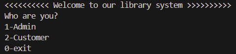
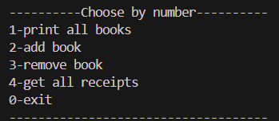
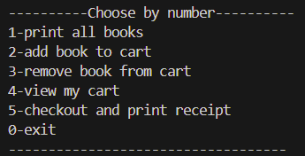

<!-- # Library System Project 📚

Welcome to the Library System Project! This project involves creating a command-line application in Dart to manage a library. The system will allow users to perform various operations based on their role: Admin or Customer.

## Installation

1. Ensure you have Dart installed on your system. If not, you can download it from [Dart's official website](https://dart.dev/get-dart).
2. Clone this repository:
    ```bash
    git clone https://github.com/turki-aloufi/Project-2.git
    ```
3. Navigate to the project directory:
    ```bash
    cd Project-2
    ```

## Usage

1. Run the application:
    ```bash
    dart run
    ```
## Data set

- We are dealing with a json data inside the file `bin/data_set.dart`.
  
## Files

### Models

- `Library`: Contains a books list of type `Book` and a cart list of type `BookOrder`, and several methods to deal with the books.
- `Book`: Contains several attributes such as `id`, `title`, `categories`, `price` ..etc.

### Classes

- `BookOrder`: This class is made to send its objects to the cart list, contains an object of type `Book` and the `quantity` to be ordered.
- `Receipt`: This class contains an `id`, `cart` list of type `BookOrder` and `total` which will hold the sum of all items in the cart, also the class contains a method `printReceipt()` that prints the receipt.
  
### Other files

- `admin.dart`: contains a function `printAdminUi()`, this function prints the options to the admin and it contains error handling.
- `customer.dart`: contains a function `printCustomerUi()`, this function prints the options to the customer and it contains error handling.

## System preview

Since the system is made for two kinds of users; when the system runs it will ask the user if he is the admin or customer.



-`1-admin`: Prints admin interface.
-`2-customer`: Prints customer interface.
-`0-exit`: Closes the system.
### Admin

Let's say the user is admin, he can make the following operations:



-`1-print all books`: Retrieves all books in the system.

-`2-add book`: Prompts the user enter book data to add it to the system.

-`3-remove book`: Removes a book by taking its id.

-`4-get all receipts`: Retrieves all receipts for customer purchases (it is empty untill you play the customer role and make 
some purchases).

-`0-exit`: Get to the previous interface. 

### Customer

Now let's say the user is customer, he can make the following operations:



-`1-print all books`: Retrieves all books in the system.

-`2-add book to cart`: Prompts the user enter book id and quantity to add it to his cart.

-`3-remove book from cart`: Removes a book from the cart by taking its id.

-`4-view my cart`: Retrieves all books in the cart with the total price.

-`5-checkout and print receipt`: Prints a receipt that contains `id`, `cart` and `total` price, and add the receipt to the list of receipts that can be viewed by admin.

-`0-exit`: Get to the previous interface. -->


# Library System Project 📚

Welcome to the **Library System Project**! This command-line application, built with Dart, allows users to manage a library system by performing various operations based on their role: **Admin** or **Customer**.

## Installation

1. **Install Dart**: Ensure Dart is installed on your system. You can download it from [Dart's official website](https://dart.dev/get-dart).
2. **Clone the Repository**:
    ```bash
    git clone https://github.com/turki-aloufi/Project-2.git
    ```
3. **Navigate to the Project Directory**:
    ```bash
    cd Project-2
    ```

## Usage

1. **Run the Application**:
    ```bash
    dart run
    ```

## Dataset

- The application uses a JSON dataset stored in `bin/data_set.dart`.

## Project Structure

### Models

- **`Library`**: Manages a collection of `Book` objects and a shopping cart (`List<BookOrder>`). It provides various methods for interacting with the books and the cart.
- **`Book`**: Represents a book in the system with attributes like `id`, `title`, `categories`, `price`, etc.

### Classes

- **`BookOrder`**: Represents an order, containing a `Book` object and the quantity ordered. It is used to populate the cart.
- **`Receipt`**: Represents a purchase receipt, containing an `id`, a `cart` (list of `BookOrder` objects), and the total price. It also includes a `printReceipt()` method for printing the receipt.

### Other Files

- **`admin.dart`**: Contains the `printAdminUi()` function, which displays the admin options and includes error handling.
- **`customer.dart`**: Contains the `printCustomerUi()` function, which displays the customer options and includes error handling.

## System Overview

Upon running the system, the user is prompted to select their role: Admin or Customer.

### Main Menu


- **1 - Admin**: Opens the admin interface.
- **2 - Customer**: Opens the customer interface.
- **0 - Exit**: Closes the system.

### Admin Interface

If the user selects the admin role, they can perform the following operations:


- **1 - Print All Books**: Displays all books in the system.
- **2 - Add Book**: Prompts the user to enter book details to add it to the system.
- **3 - Remove Book**: Removes a book by its `id`.
- **4 - Get All Receipts**: Retrieves all customer purchase receipts (empty until purchases are made by customers).
- **0 - Exit**: Returns to the main menu.

### Customer Interface

If the user selects the customer role, they can perform the following operations:


- **1 - Print All Books**: Displays all books in the system.
- **2 - Add Book to Cart**: Prompts the user to enter the book `id` and `quantity` to add it to their cart.
- **3 - Remove Book from Cart**: Removes a book from the cart by its `id`.
- **4 - View My Cart**: Displays all books in the cart along with the total price.
- **5 - Checkout and Print Receipt**: Generates and prints a receipt with the `id`, `cart`, and `total` price, and adds the receipt to the list of receipts viewable by the admin.
- **0 - Exit**: Returns to the main menu.
