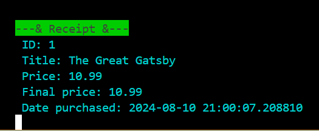

# Aziz's Library: A Command-Line Book Management System 📚

Welcome to Aziz's Library!  This is a command-line program that lets you manage a virtual library of books.

# Features:

# 1- Administrators:
<ul>
<li>Add new books (including authors, categories, year, quantity, and price).
</li>
<li>Remove books from the library by their unique ID.
</li>
<li>View all books with detailed information.
</li>
<li>View a history of all purchases made by customers.
</li>
</ul>

# 2- Costumer 
<ul>
<li>Buy books by searching for their title (case-sensitive).
</li>
<li>View all available books (those with a quantity greater than 0).
</li>
<li>Check their purchase history with details like price and date.
</li>
</ul>

Open a terminal in the project directory.
Run the program using dart main.dart
Using the Library:

You'll be greeted by a welcome screen offering options to Login as Administrator, Customer, or Exit.

Administrators: Enter "1" to access admin features. Here, you can choose to add, remove, view all books, or view purchase history.

3- view all books

Customers: Enter "2" to access customer features. Here, you can buy books, view available books, or view your purchase history.

You'll be provided with the available books and their prices automatically when you choose option 1 (Buy a book).

If purchase is successful

If you try to purchase something that is available but out of stock

if you enter wrong title name

Receipt option

# Tips:

When adding books, separate authors and categories with commas (e.g., "F. Scott Fitzgerald" for authors, "Fiction, Classic" for categories).
When buying books, ensure you type the exact title (case-sensitive).
Feel free to explore the program and have fun managing your virtual library!

