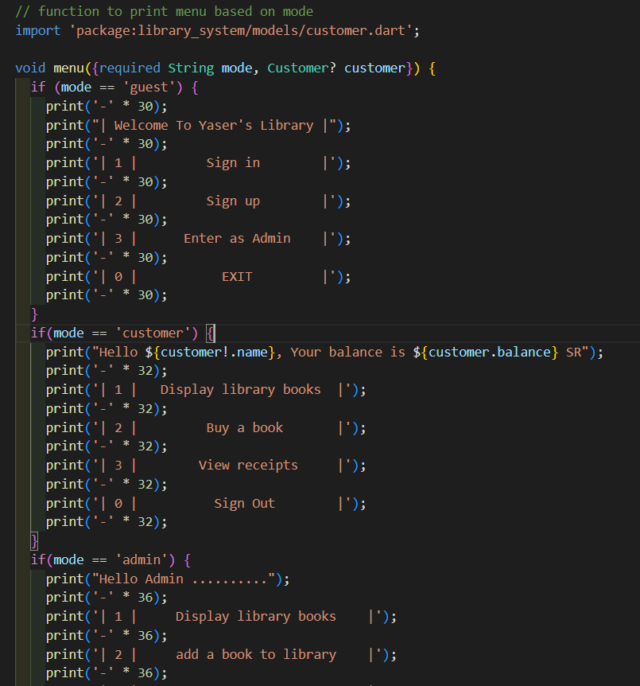
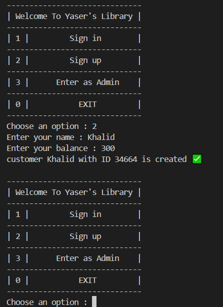
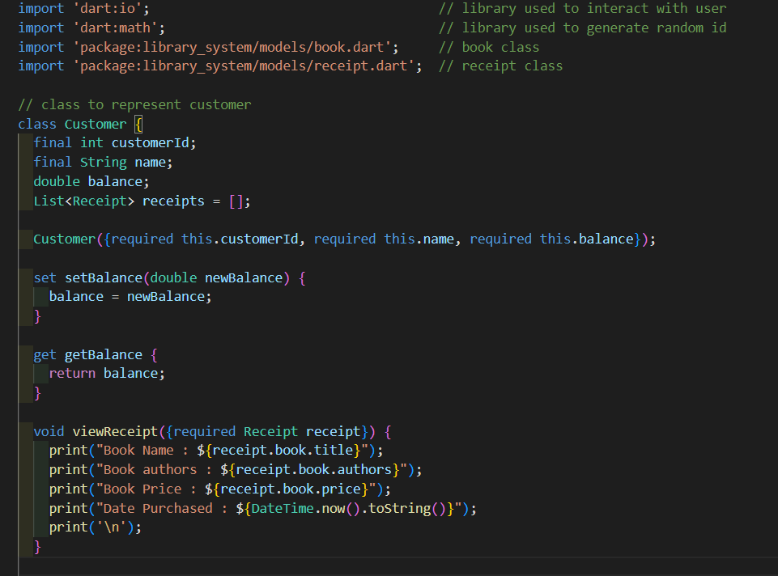
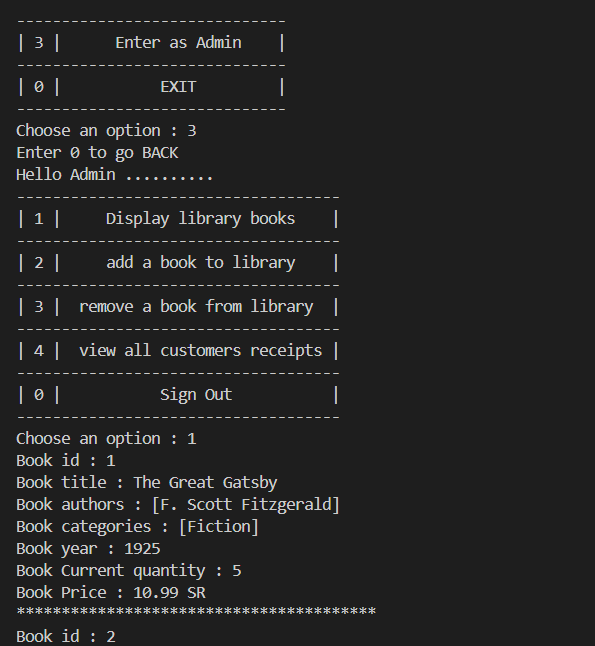
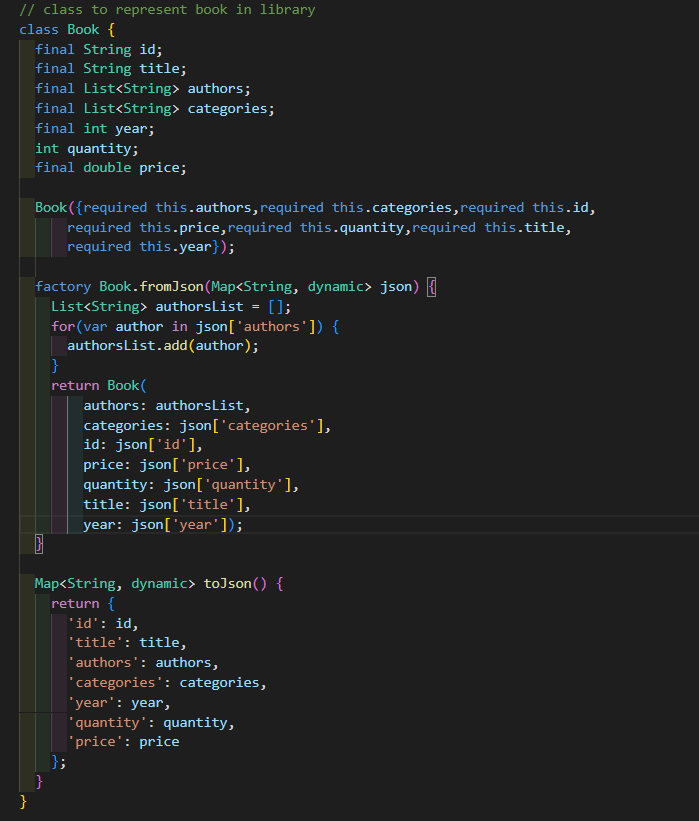

# Library System 📕📗📘

 

# 1. Overview 📖
Library system is a CLI "Command Line Interface" application that tracks customers shopping in the library, which can be helpful to know how many people likes some type of books.

# 2. Requirements ❓
The system is based on two stakeholders :
- **Admin** : The person who is responsible for the library content by adding or removing books to/from the library.
- **Customer** : The person who reaches out the library to purchase a book and enjoy reading it.

# 3. Code and Implementation 💻
In this section, we will dive into the details of the implementation of classes and some important methods/functions

## 3.1 Menu

 

The application menu is customized based on the type of user using the application, in our library system, we have 3 types of menus :
### 3.1.1 Guest Menu
The first menu to appear to whoever uses our system and it has 4 choices as follows :\
    1. **Sign in** : By providing a valid customer id, customers can sign in through this option.\
    2. **Sign up** : In this option, user can be a new customer of ours by entering his basic data.\
    3. **Enter as admin** : Admin will access the library through this option.\
    4. **EXIT** : closes the program

### 3.1.2 Customer Menu
This is the menu that appears to user after registration, where they are be able to do the following :
- **Display library Books** : this option will print all the available books in the library
- **Buy a Book** : customers can buy books through this option.
- **View Receipts** : customers can view their purchase history by choosing this option.
- **Sign out** : this will exit the customer mode and we'll go back to pre-regestration process.

### 3.1.3 Admin Menu
This is the admin menu where rhey can access the content of the library by adding or removing books, their actions can summerize as follows :
- **Display library books** : this is the only option in common between customers and admin.
- **add a book to library** : this is where library gets updated with new books, the added books info and details are all filled by admin.
- **remove a book from library** : the opposite of the option above, where a book gets removed from the library.

- **view all customers receipts** : this can provide an ultimate view of customers and their shopping behaviours.

## 3.2 Customer class
This is the class that represents a library customer, it has the following attributes :\
    1. **customerId** : which is the identifier for customers and cannot be duplicated.\
    2. **name** : the customer's name, it is used to view greet messages.\
    3. **balance** : the customer's balance, it is used to perform purchase operations.\
    4. **Receipts** : the customer's purchase history.

Customer class has also the following methods :\
    1. **setBalance and getBalance** : used to update/retrieve the customer's balance.\
    2. **view receipt** : this method will print info about certain receipt\
    3. **buy book** : this is the method that gets called whenever the customer want to purchase an available book.

## 3.3 Admin page
Admin page is where an admin can control the library content, whether by adding books or removing some.

## 3.4 Book class
This class represents a book in library and includes the following attributes :
- **id** : The book id, which is unique.
- **title** : The book title or name.
- **authors** : The list of authors of the book.
- **categories** : The list of categories of the book.
- **year** : The year the book was published in.
- **quantity** : The number of copies of this book.
- **price** : The price of the book in SR.

 

# 4. Conclusion 🏁
The library system helps libraries to digitalize their work by providing both the customers and admins the best and easiest experience.

 

**Author : Yaser Alkhayyat**