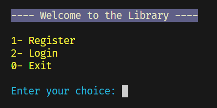
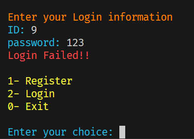
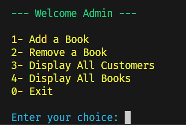
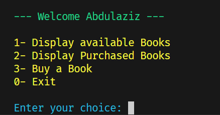
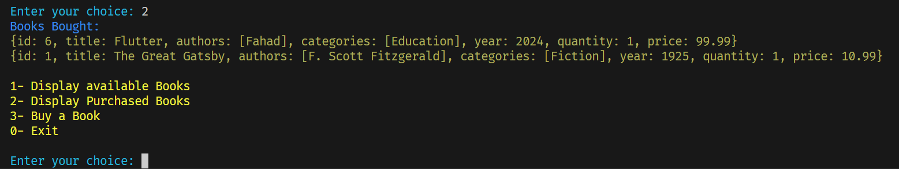

# Library Management System

A console-based application for managing a library's book inventory, customer purchases, and purchase history.

## Description

The Library Management System is designed to allow Admin to manage a library's book collection, by adding/removing books, and customers to purchase books. The system keeps track of book purchases and maintains a history of purchased books for each customer. Admins can also view the purchase history of all customers. The application is built in Dart and utilizes object-oriented principles to organize and manage data efficiently.

## External Features
- Add/remove Books: Admin can add/remove books to/from the library's inventory.
- Purchase Books: Customers can purchase books and receive a receipt.
- View Purchase History: Customers can view their purchase history.
- View All Purchases: Admins can view the purchase histories of all customers.
- Data storing: Customer data and book purchases are stored in a JSON file.

## Internal Features
- Automoatic ID generation in ascending order for Books and Customers.
- Passwords are hashed using the SHA-256 algorithm for security.
- Object-oriented design that uses classes to model different entites in the system
- Data stoed in json is read at the start of the program for easier use of the system.
- Input validation used, for example on first and last name when containing numbers.
- Error handling by using try-catch, and throw-rethrow to handle different scenarios of user input.
- Red color is used to print error messages to draw attention to the user
- asynchronous operations are used for reading json files
- Inheritance (Admin and Customer extend User)





## Getting Started

### Dependencies

Before running the program, ensure you have the following prerequisites:

- Dart SDK installed
- Compatible with any operating system that supports Dart (Windows, macOS, Linux)

### Installing

1. Clone the repository to your local machine:
```bash
git clone https://github.com/Abdulaziz-Alamri/project-2.git
```

2. Navigate to the project directory:
```bash
cd  .\Project-2\library-system\
```
3. Install the required Dart packages:
```bash
dart pub get
```
### Executing Program

To run the program, use the following command:
```bash
dart run
```

### Step-by-Step Usage

**Register into the system**
If you are new, Enter 1 to register, otherwise choose 2 to login
- Make sure your First and Last Name do not contain numbers!!


**Login to the system**
Enter your ID and password to login. Both must be correct.



**For Admin**
- Add a Book: Choose the option to add a new book by filling in its information.
- Remove a Book: Choose the option to remove an existing book by its ID.
- View All Customers: Choose the option to view all customers and their purchase information.
- View All Available Books:  Choose the option to view the available books in the libbrary.



**For Customer**
- View All Available Books:  Choose the option to view the available books in the libbrary.
- Buy a Book: Choose the option to purchase a book. You will be prompted to select a book from the available inventory by ID.



- View Purchase History: Choose the option to view your purchase history



**Exit the Program**
Enter 0 to logout and 0 again to exit the program.

## Help
If you encounter any issues:
- Make sure you choose the correct option
- Make sure you type the correct values
- Follow the tips of the program when encountering a problem

## Authors
Abdulaziz Alamri

## Version History
**See commits history for more details**
- fixed printing of purchased books
- added Ansicolor package and changed print colors
- added menu() in screens folder, tested and corrected data flow
- added displayAllCustomers() and login functionality
- added customer methods, updateUser(), updated readFile()
- added class User and Customer and Admin + fixed file reading
- added updateData() and readFile()
- added methods to add/remove/buy book and displayReceipt
- added class Library and Book + tested data to objects correctness
- created library-system dart project


## Acknowledgments
Tuwaiq Academy


## Project Folders Structure
Library-Management-System/
│
├── assets/
│   └── images/
│       ├── 1.png
│       ├── 2.png
│       ├── 3.png
│       └── ...              # Images for README.md
│
├── bin/
│   └── library_system.dart  # Main entry point
│
├── data/
│   ├── data.json            # JSON file containing library data
│   └── users.json           # JSON file containing users data
│
├── model/
│   ├── library.dart         # Library class and related methods
│   ├── book.dart            # Book class and related methods
│   └── user/
│       ├── user.dart        # Super User class with common attributes
│       ├── admin.dart       # Admin class, inheriting from User
│       └── customer.dart    # Customer class, inheriting from User
│
├── screens/
│   └── menu.dart            # Handles the main menu UI
│
└── utils/
    ├── filemngmt.dart       # File management methods for reading and writing JSON files
    ├── login.dart           # Handles login functionality and user authentication
    ├── updatedata.dart      # Function for updating library data
    └── updateuser.dart      # Function for updating customer information