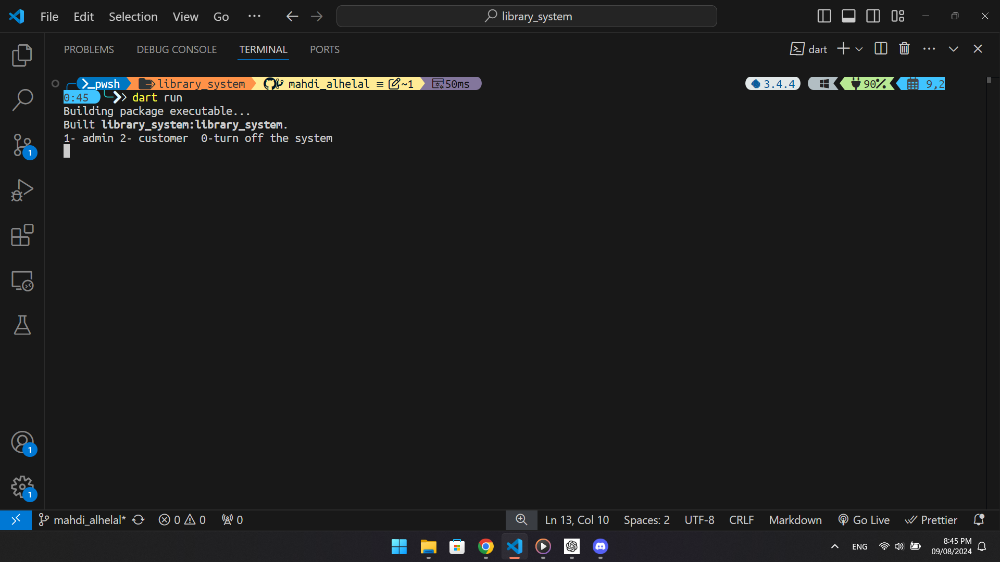
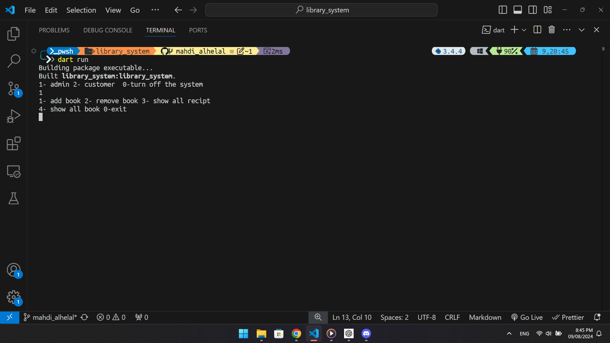
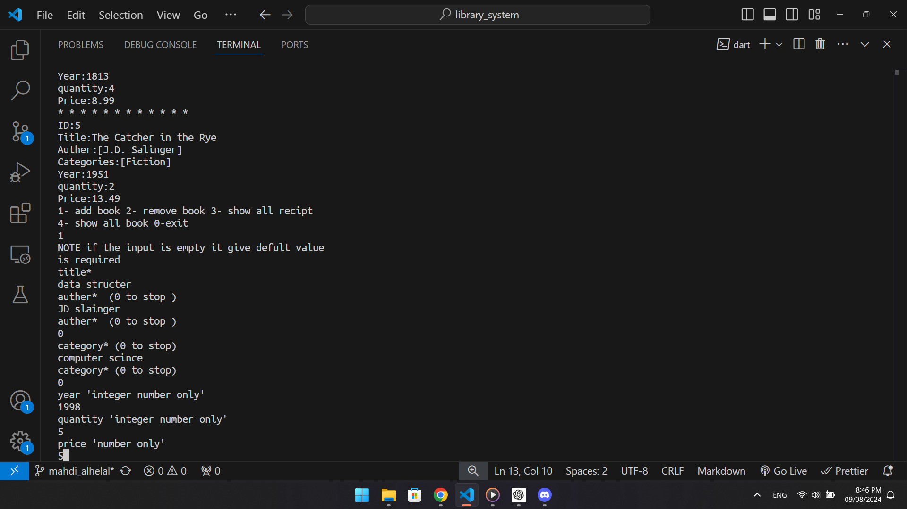
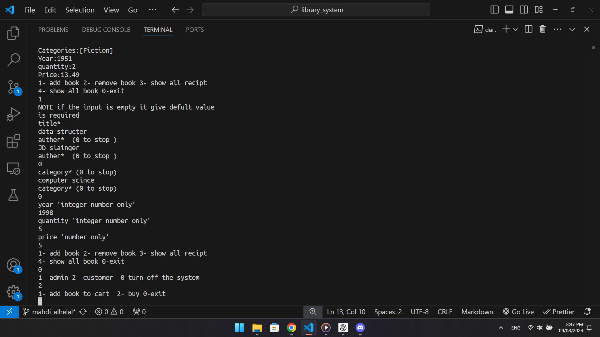
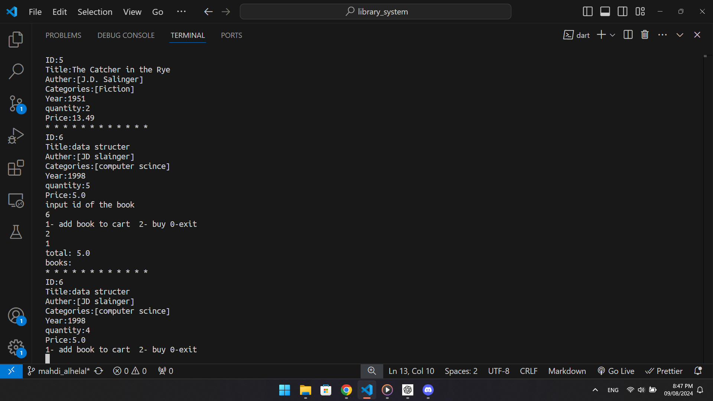
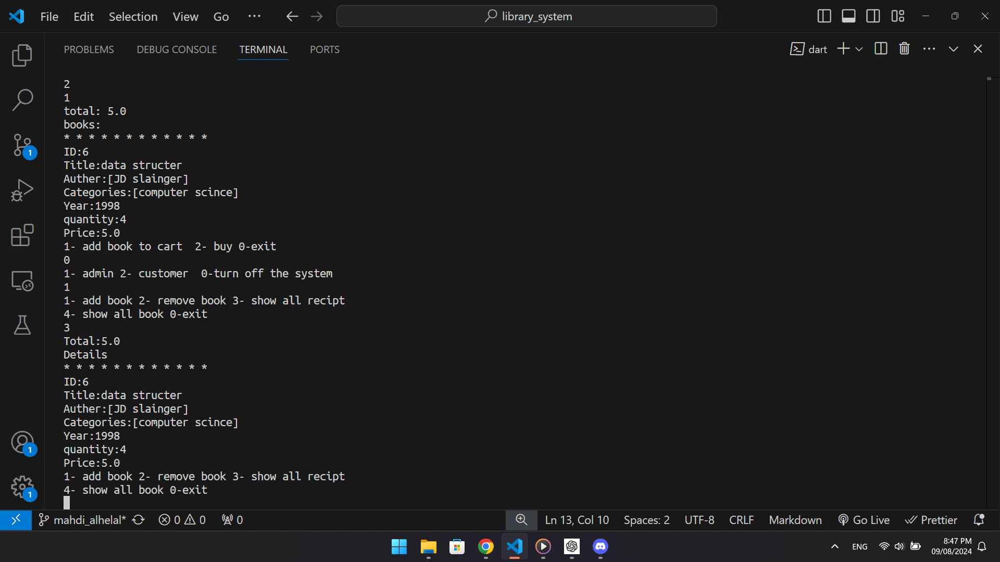

# Library System Project 📚

this a simple CLi where it do the flowing function 
- **Add a Book admin only**: Add new books to the library.
- **Remove a Book admin only**: Remove books from the library.
- **Buy a Book**: Purchase a book if it's available.
- **Display Receipt**: Show a receipt for the purchase.

## Roles
Admin and User.

# Sampels

  

  
   
  
  
  
  
  

