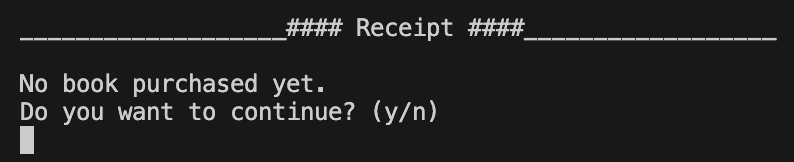
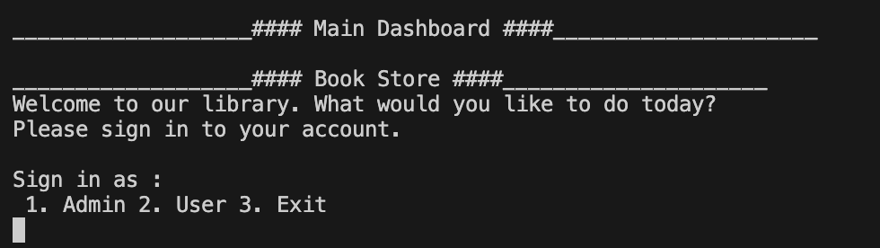
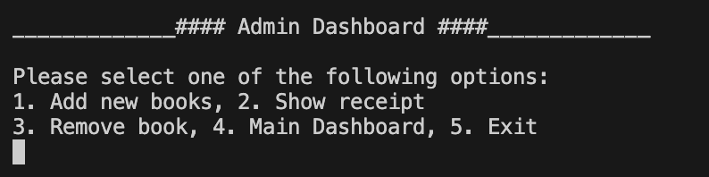
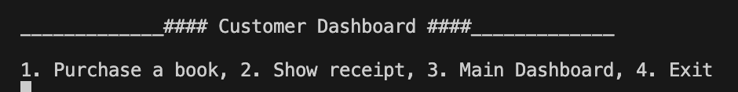
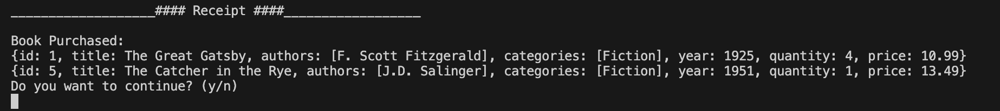
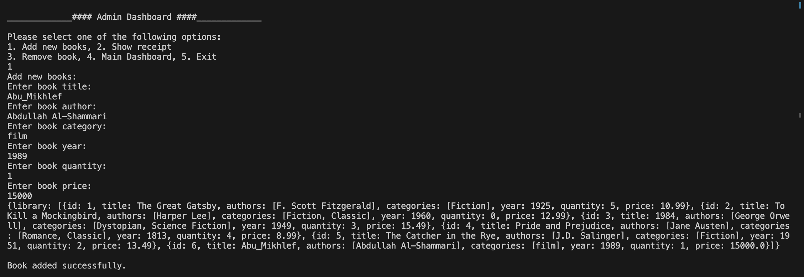
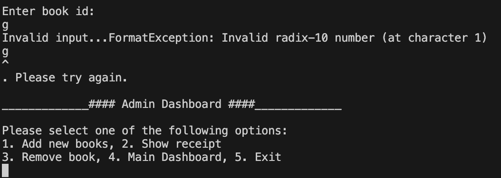

# Simple Library System  :book:
a simple application to manage library of books,
contain information of books like title, author, category, year, quantity, price, and id:
there are 2 dashboards:
1. for admin and have access to all features
2. for customer and have access to some features

---

### It is imperative to verify that the <!--Links-->[Dart](https://dart.dev/)<!--Links--> language is installed on your machine before proceeding.

## Features
1. ###### Add New Books(admin only)
2.  ###### Remove Books(admin only)
3. ###### Purchase Books(customer only)
4. ###### Show Receipt(admin and customer both)

## The concepts that were applied in this project
1. Factory constructor(deserialize) to create a LibraryModel from JSON data
2. JSON data is created by using toJson method to serialize the data
3. Error handling with try catch,if else and switch case.
4. Alert about error and how to use it without crashing. 

## how to use it
* You **must** purchase books first. If you want to show receipt, you must repeat this process every time you start. Why? Because we store in a list, not in a database, **so you need to pay attention to that**.

___

### Main Dashboard

---
### Admin Dashboard

### Customer Dashboard

### Receipt

---

#### Example for input data(correct data)

#### Example for input data(wrong data)
