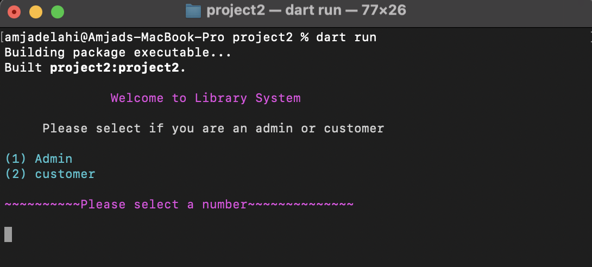
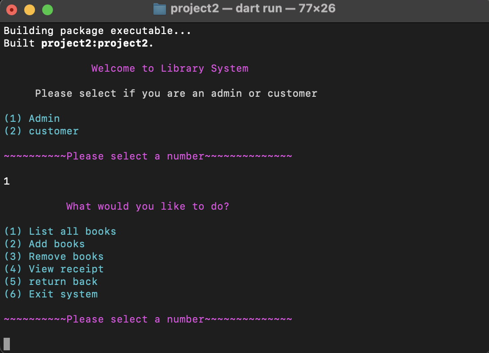
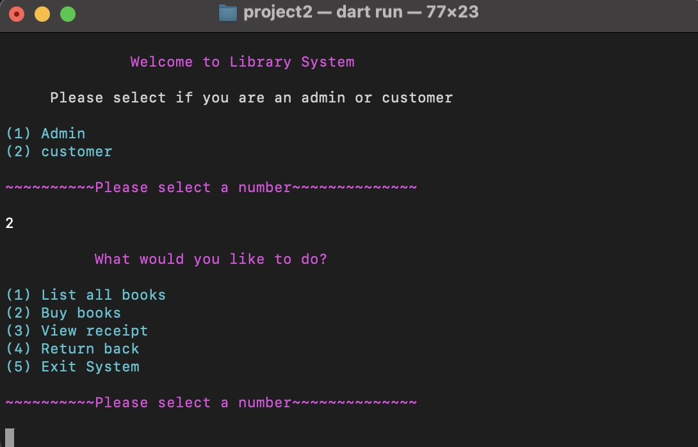
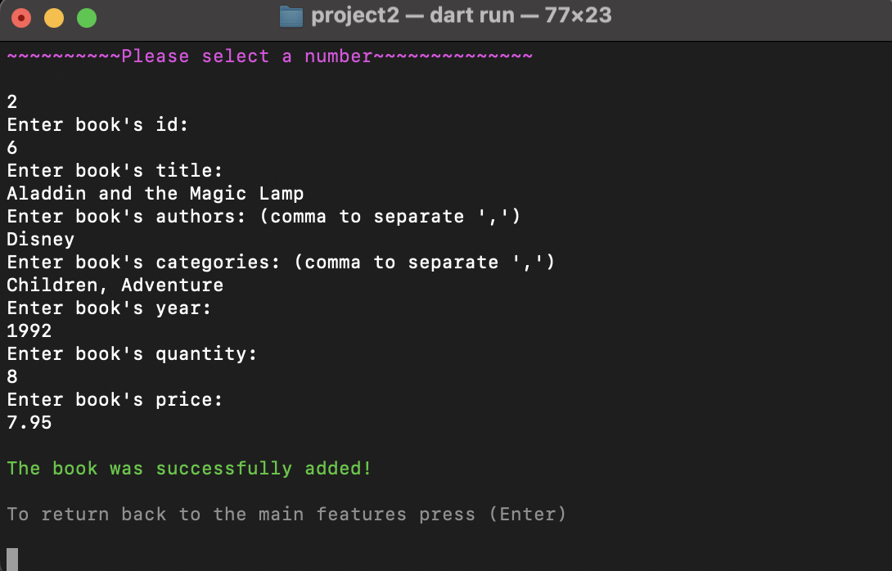
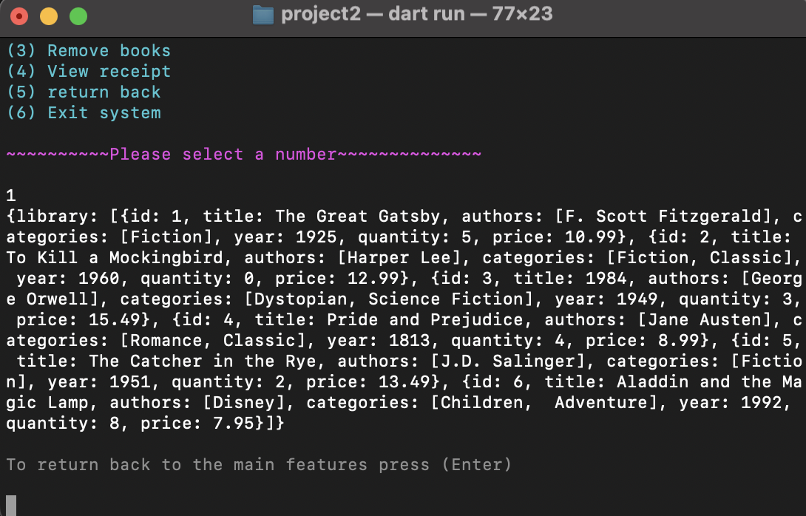
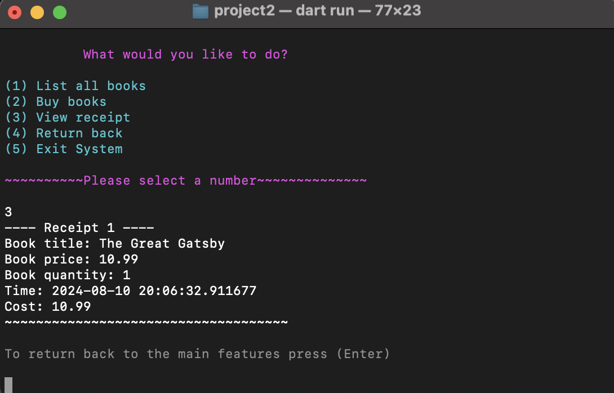
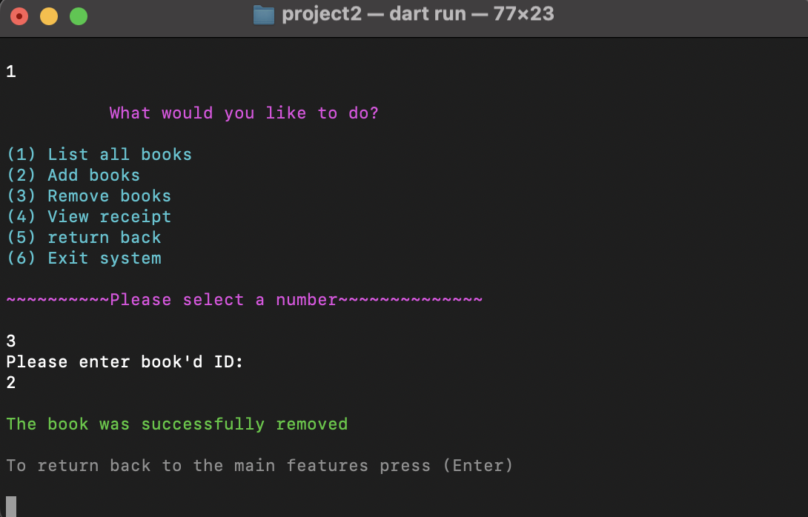
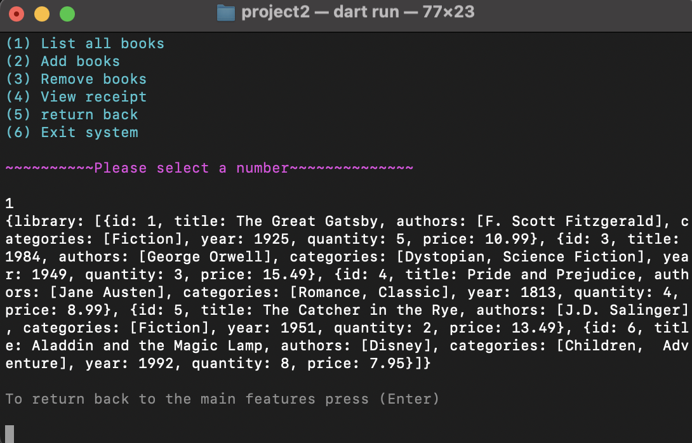

<p align="center">

<br/>

# Library System Project 📚

 Welcome to the Library System Project! This project involves creating a command-line application in Dart to manage a library. The system will allow users to perform various operations based on their role: Admin or Customer.

## Requirements

 In order to run the application, this project requires a Dart SDK and a command line interface (CML).

## install dart SDK
 install dart SDK from [dart documentation](https://dart.dev/get-dart)

## How to run the project

1. Open terminal or CMD.
2. Navigate to the project path, such as 
```bash
cd /Users/amjadelahi/dart-bootCamp/Project-2/project2
```
 3. Run the application with a command: 
```bash
dart run
```
 the app's user roles and greeting message will be displayed to you, like the one in the picture below..

 <p align="center">

<br/>

 4. Choose a number to indicate whether you are a customer or an admin.

 5. As an admin, you have the ability to list, add, remove book and view purchase receipts for books.

 <p align="center">

<br/>

 6. As a customer, you have the ability to list all book, buy a book and view the receipt for their purchase.

<p align="center">

<br/>

 7. To add a book, choose option number 2 and enter the book's details.

<p align="center">

<br/>

 8. Use the key (Enter) to return to the main features.
 9. To list all books, select number 1.

 <p align="center">

<br/>

 10. Choose number 5 to go back to the user role and switch to the customer role.

 11. To buy a book, select number 2, then provide the book's ID and the quantity of copies you would like.

<p align="center">

<br/>

 12. To view receipt of their purchase, choose number 3.

<p align="center">

<br/>


 13. to remove a book from admin features, choose number 3, then enter book's ID.

 <p align="center">

<br/>

 13. In order to check if book was removed form system, choose number 1 to list all books.

<p align="center">

<br/>

 14. Finally, select number 5 in customer featurs or number 6 in admin features to exit the app.

 


