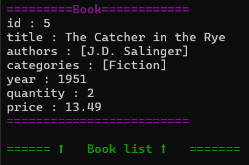
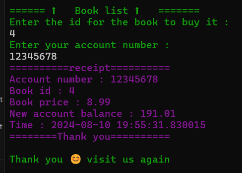
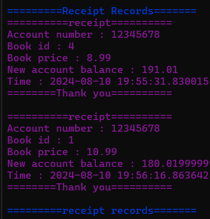
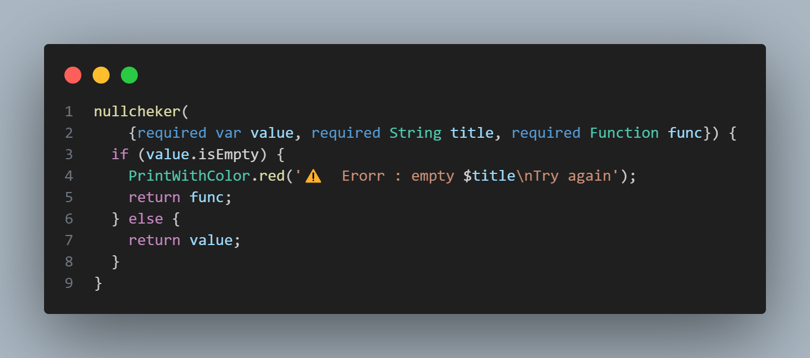
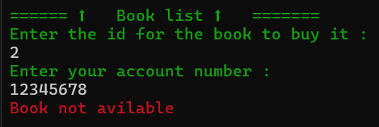
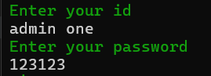

# Library System Project 📚

Welcome to the Library System Project! This project involves creating a command-line application in Dart to manage a library. The system will allow users to perform various operations based on their role: Admin or Customer.
the project include handle library data from a json file .
## Main fetuers

## Main Screen

### Add && remove Books
The project allow `admins` to add or remove book to the library system

### Buy && Display Books
Customers can buy or discover the book List

### Display Receipt && Display Receipt logs
Customer get receipt after they buy a book

and admin can view the receipt records

### Error handling
The project use `try & catch` and `null checker` function to handle error
in example for handling empty id :

`null checker` function :

if the book is out of stock :

### Role mangment
The project display function based on users role in example
if admin want to use they function they need to `login` in first

Feel free to use with account name mentioned

by `Basel-75` Github