# Library System
this library system 

**Features:**
<li>can't buy book if quantity is 0
<li>try catch
<li>user and admin roll

* User Authentication: Login as either admin or customer using predefined credentials.
* Admin Panel:
    * Add new books to the library.
    * Remove books from the library.
    * View purchase history from all customers.
    * View all books in the library.
* Customer Panel:
    * Purchase books (if available).
    * View personal purchase history.
    * View available books in the library.

**Dependencies:**

* dart:io: Provides standard input/output functionality.

**Running the Application:**

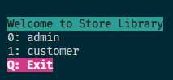
* sign in panel will check if the user have admin roll or customer and will display his panel mode

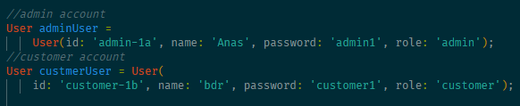
* the main account only tow admin and a customer in future it will be more efficient

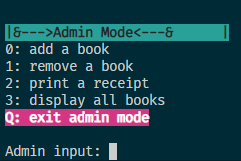
* admin can do these operation and contain try catch 

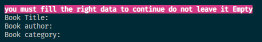
* if the admin add a book most fill all the information other wise it will continue the add if not it will be loop until fill it

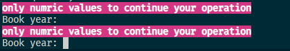
* same goes here most fill a numric data only to continue

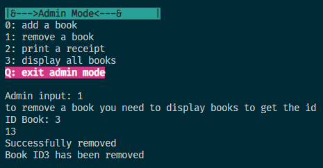
* to remove a book you need to write the id of book 

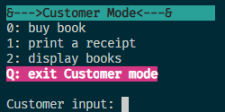
* customer mode can do: buying \ print receipt \ display book to choose on of them

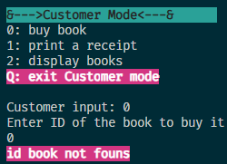
* if the customer enter a wrong id it will show msg color

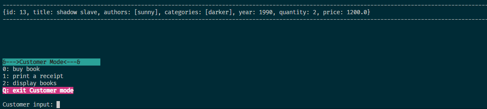
* here i display the books and choose id 13 to buy it

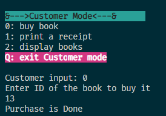
* purchase is success

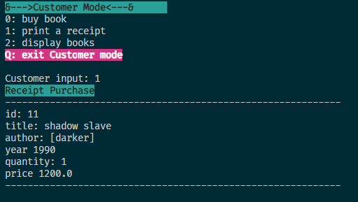
* the reciept for customer and admin

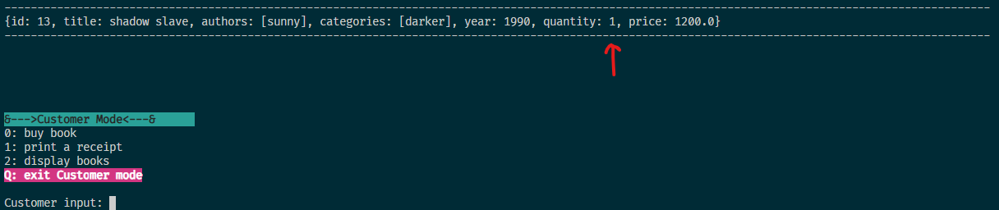
* after purchased the quantity decrease by 1

**Code Structure:**
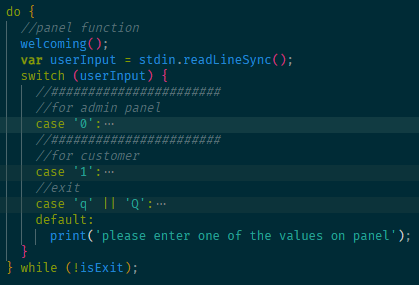
* roll for users admin and customer

