<p align="center">


# Library System Project
Welcome! This project is a command-line application written in Dart to manage a library. There are two types of users: admin and customer, each with different actions.

## Project Overview
***Library System Models:***

In Library system project there are two models the first one called `LibrarySystem` which is map that conten list of library.  The other model  is called `Library` which has many features like `id`, `title`, `list of authors`, `list of categories `, `year`, `quantity`, and `price` this features are used for organize library.

*Library system has many oprations:*

 **Admin Opreations:** 
 1. Add a new book by Admin.
 2. remove Book by admin.
 3. Display all receipts.
 4. Display receipts of one customer.

**Customer Opreations:** 

1. Buy a book.
2. Display receipts.

## Getting started
 ### Dependencies
You need to install the Dart programming language.

### Executing program
1- Fork the Repository.
2- Copy url then go to terminal and write: 
```
git clone ‹url›
```
3- Go to the cloned project using:
```
 cd < PROJECT-NAME> /
 ``` 
4- Create a new branch and checkout this branch: 
```
git checkout -b branch-name
```
5- To create and start dart project 
```
dart create project_name
cd project_name
code .
```

6- Now to run the program in terminal write:
```
dart run
```

### How dose it works?
1. Select type of user.
<p align="center">
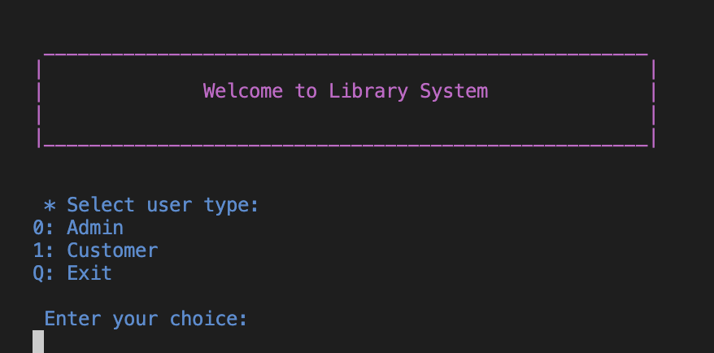


2. `Admin` user has many opreation to perform:
<p align="center">
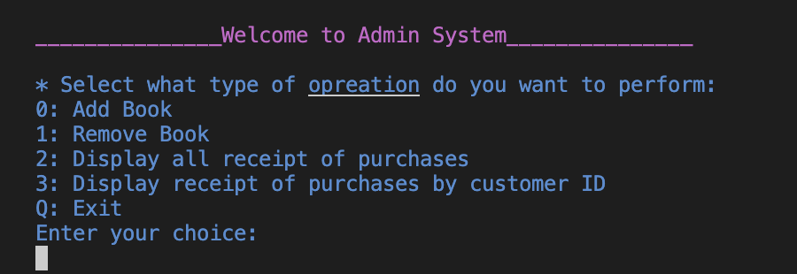

   - `addBook` function is used to add new book to Library. The admin must enter importent data about book to the system like `bookId` which is unique, `bookTitle`, list of `bookAuthors` at least one, list of `bookBategories` at least one, `bookYear` of publishe must be between 1500 and 2024, `bookQuantity` must be at least one, and `bookPrice` must be between 20 and 2000. Here are some examples of correct and incorrect inputs:
   <p align="center">
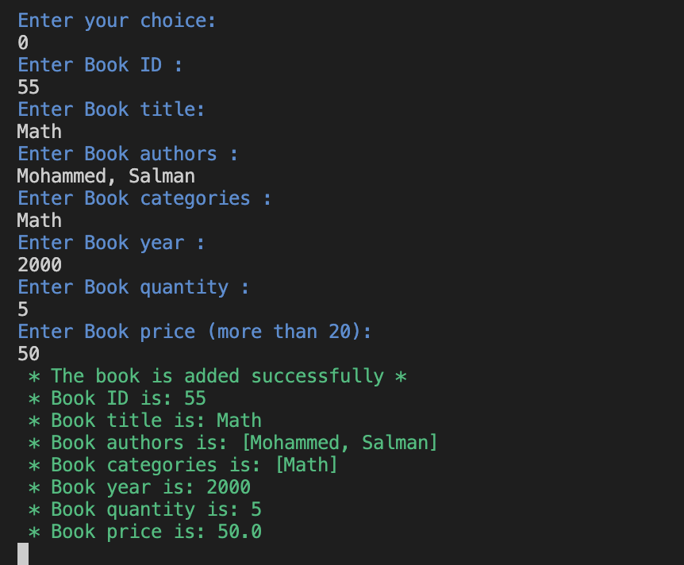

   <p align="center">
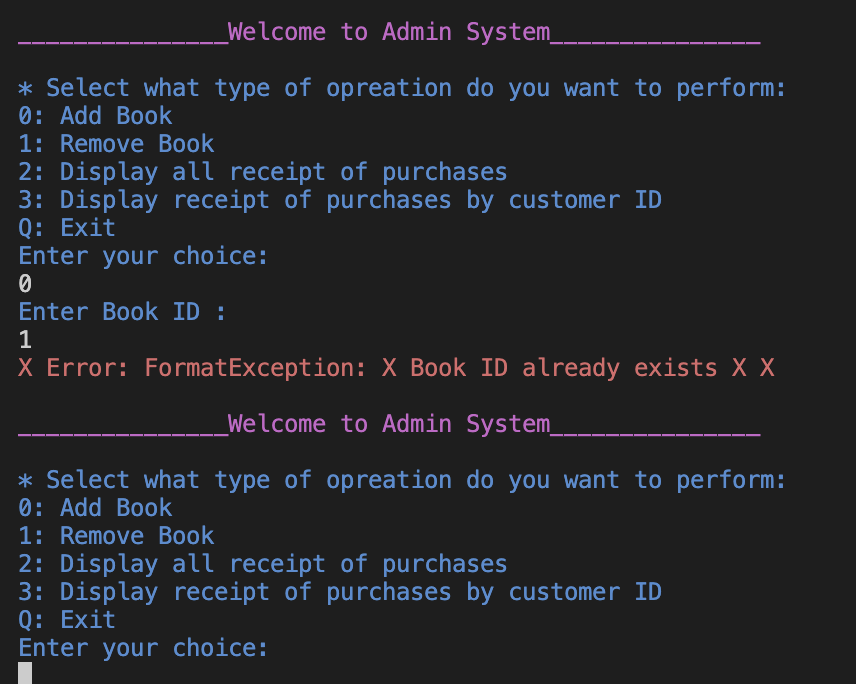

   <p align="center">
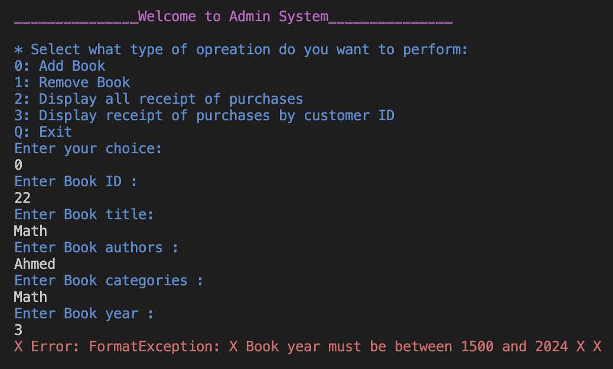


   - `removeBook` function is used to remove book from the library using `bookId`.Here are some examples of correct and incorrect inputs:

<p align="center">
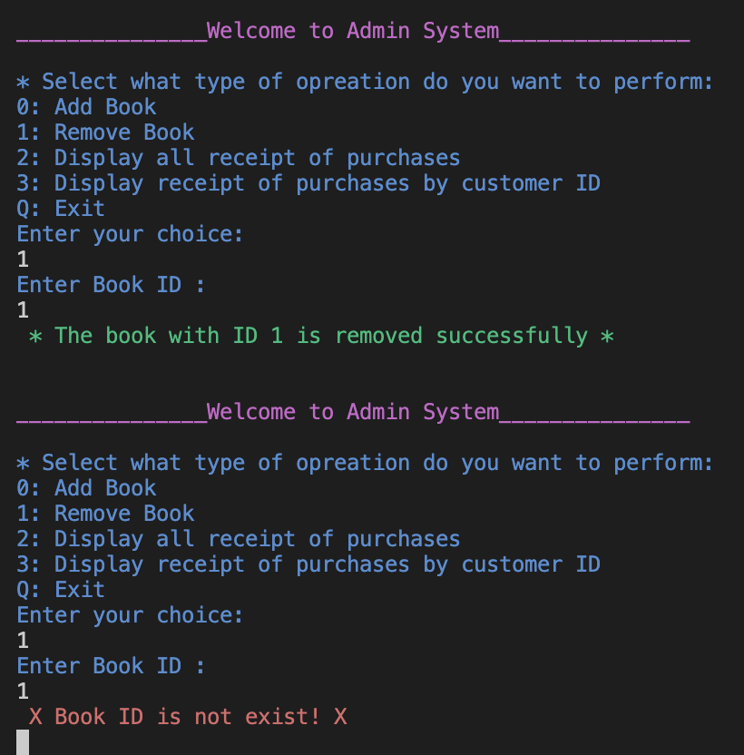


   - Display all receipt of purchases of all customer
<p align="center">
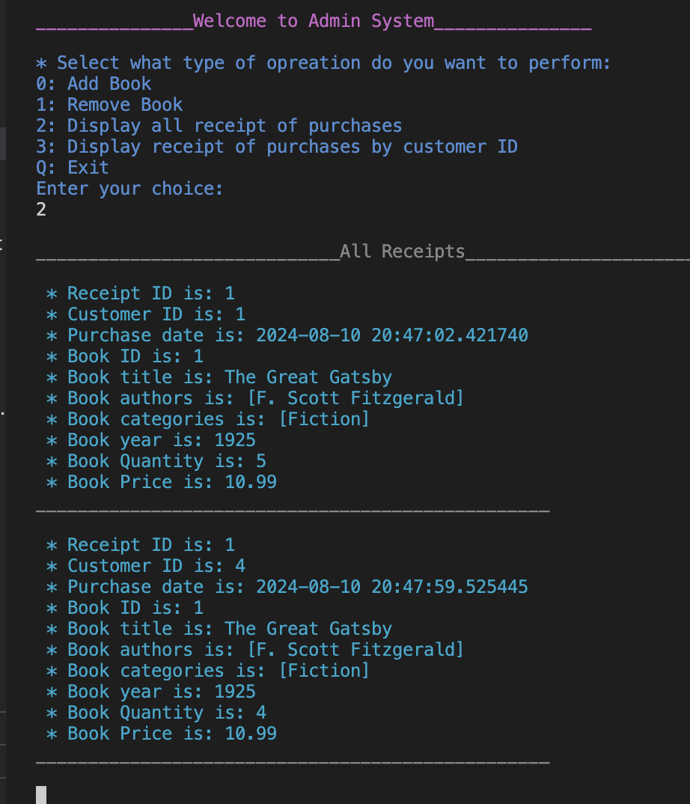

   - Display receipt of purchases for one customer by `customerID`.

<p align="center">
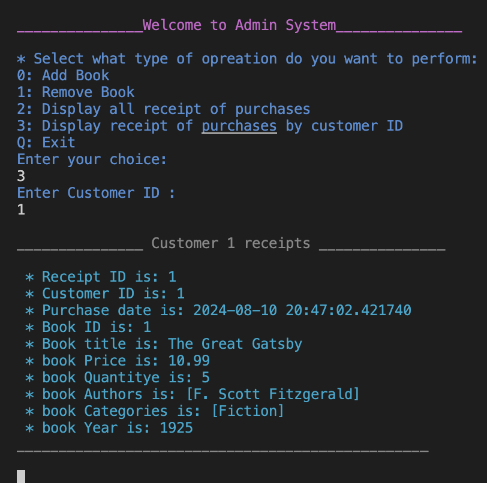

   - If the Admin wants to exit, they must enter `Q` || `q` once to exit the Admin System and twice to exit the Library System. example:

<p align="center">
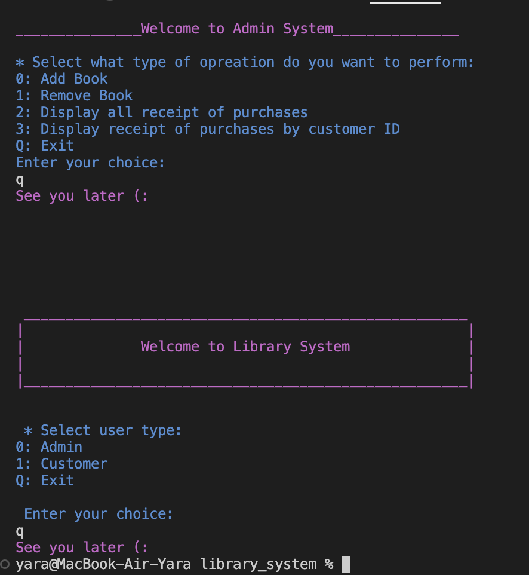
   


3. On the other hand, the `Customer` user has other opreation to perform:
 <p align="center">
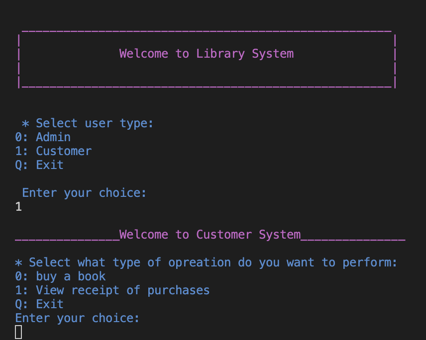

  - The `buyBook` function is used by the customer to buy a book using the `bookId`. The customer must enter their own `ID` and the `quantity` of books to purchase; the quantity must be one or more."
  <p align="center">
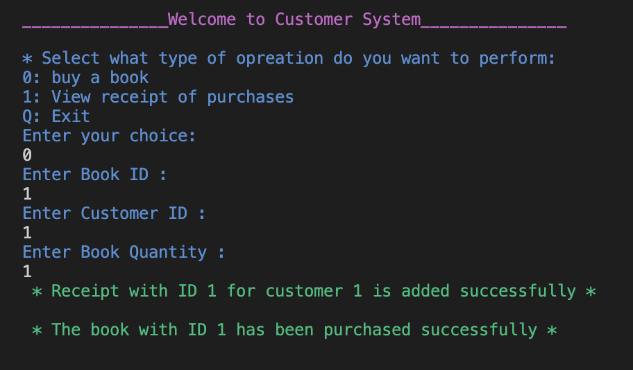
<p align="center">
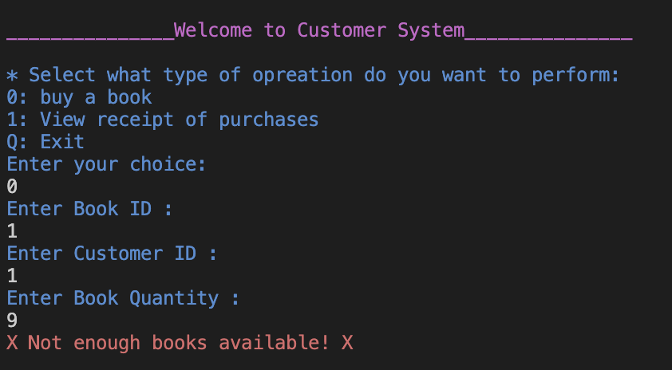


  -  The customer can display their own purchase receipts.
   <p align="center">
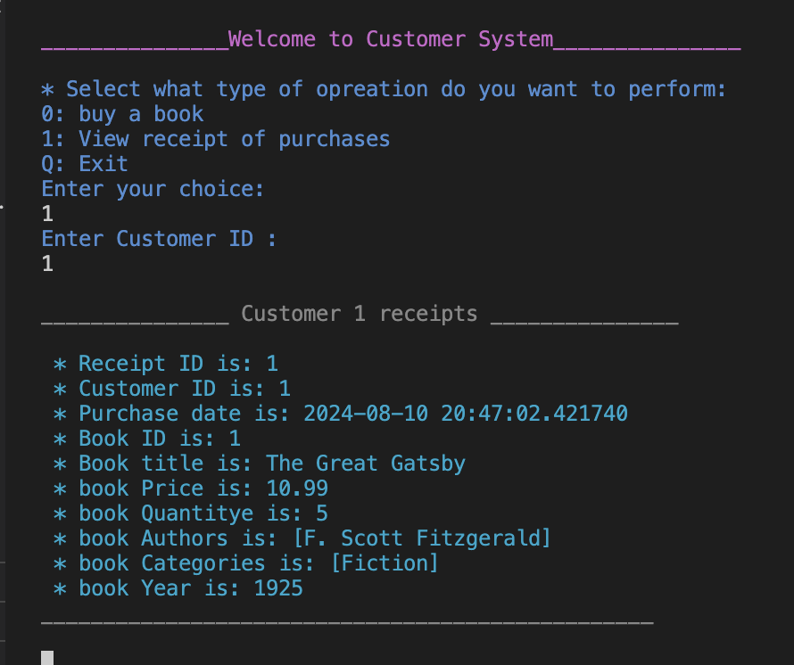

  - If the Customer wants to exit, they must enter `Q` || `q` once to exit the Customer System and twice to exit the Library System.
  <p align="center">
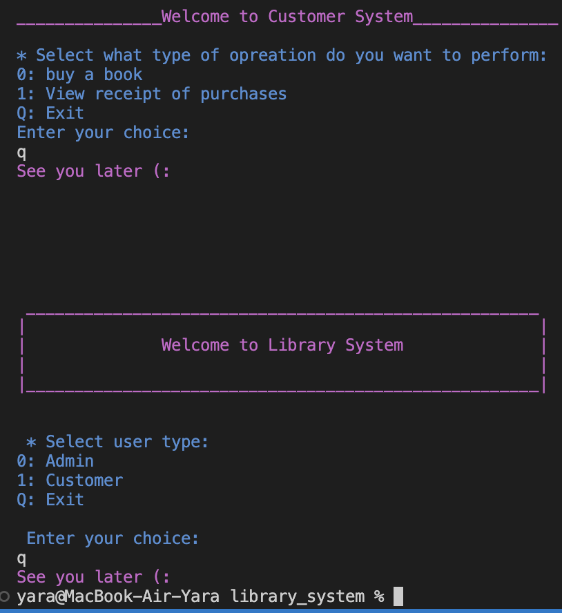


<p align="center">
  
