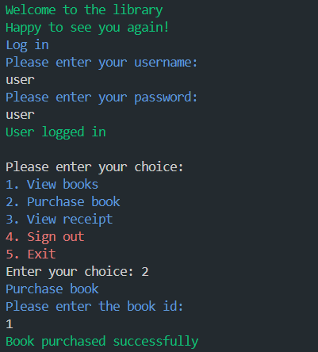

# Library System Project 📚

## Description
Welcome to the Library System Project! In this project, you'll develop a command-line application in Dart to manage a library. The system will support various operations tailored to different user roles, including Admin and Customer.

## Getting Started

### Dependencies
- Dart SDK

### Installing
1. **Clone the repository:**
   ```bash
   git clone https://github.com/imahacs/Project-2
    ```
2. **Navigate to the project directory:**

    ```bash
    cd project-2
    ```
3. **Install the required dependencies:**

    ```bash
    dart pub get
    ```
4. **Ensure that you have the Dart SDK installed.** If not, download and install it from the [Dart's official website](https://dart.dev/get-dart).

### Executing Program
To run the program, use the following command:
```sh
dart run
```
### Sample Output
The program will provide the following outputs based on user roles:

**Admin**:

- Add, remove, or update books.
- View receipts for purchases.
- View books.

**Customer**:

- Purchase available books.
- View receipts for their purchases.
- View books.

### Example Usage
- Admin login correctly:

    

- Error handling "FormatException":

    

- Book purchase successfully:

    

- View receipt:

    

## Help
For common issues or troubleshooting:

- Ensure all dependencies are correctly installed.
- Verify that your Dart SDK is up to date.
- Review the code and verify that JSON data structures match expected formats.

For additional help, consult the Dart documentation or open an issue on the project's GitHub repository.

## Authors
- imahacs - [GitHub Profile](https://github.com/imahacs)

## Version History
- 0.1 - Initial Release

## License
This project is licensed under the MIT License - see the [LICENSE](LICENSE) file for details.
.

## Acknowledgments
- Inspired by various Dart and JSON handling tutorials.
- Thanks to the open-source community for their contributions and support.

